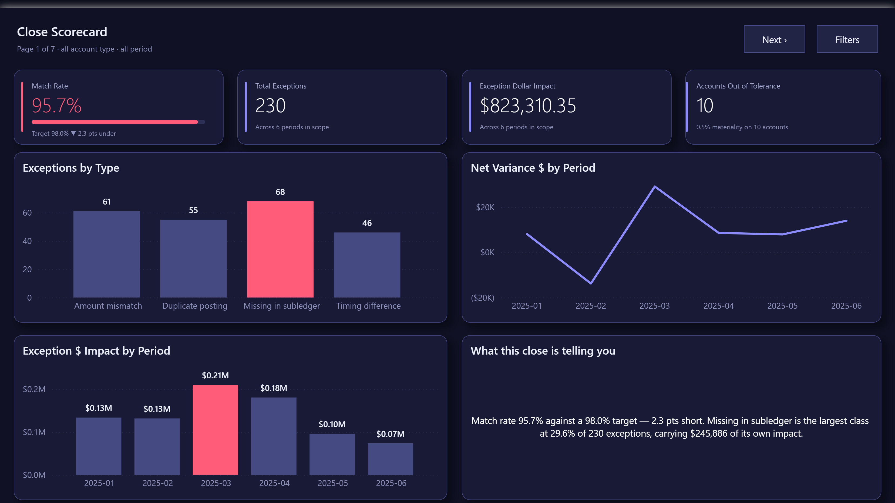
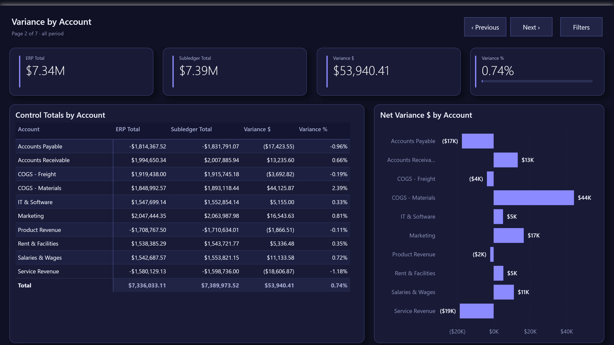
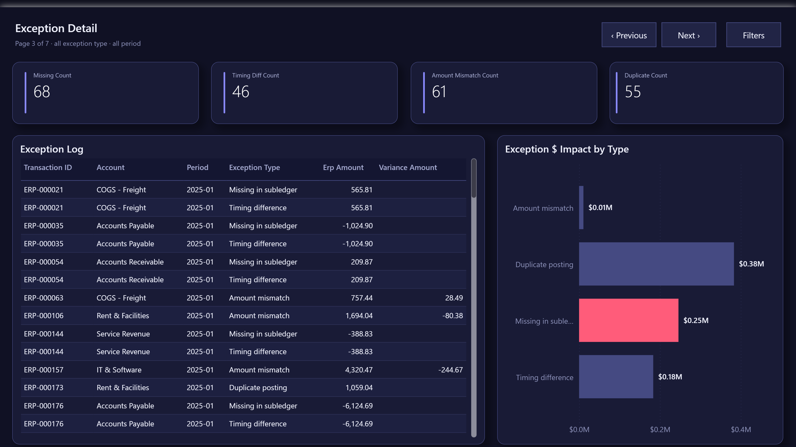
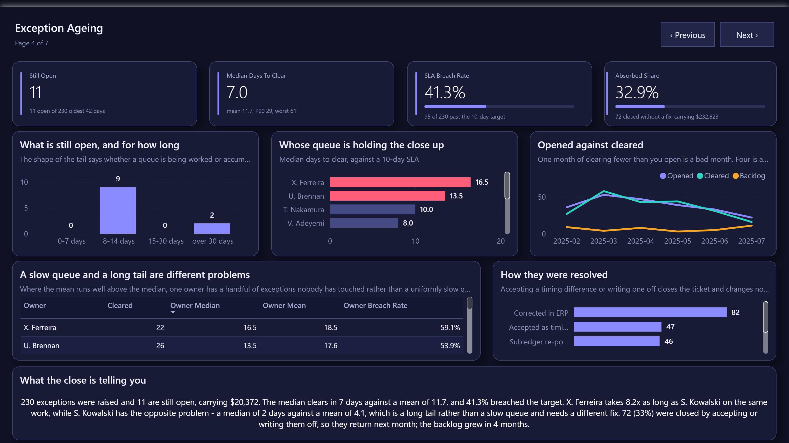
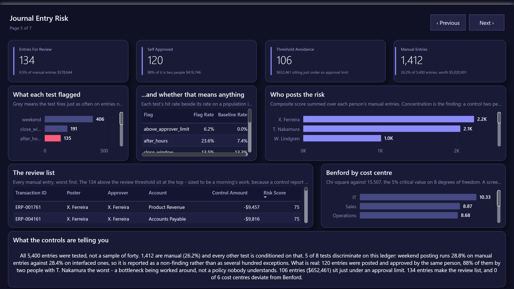
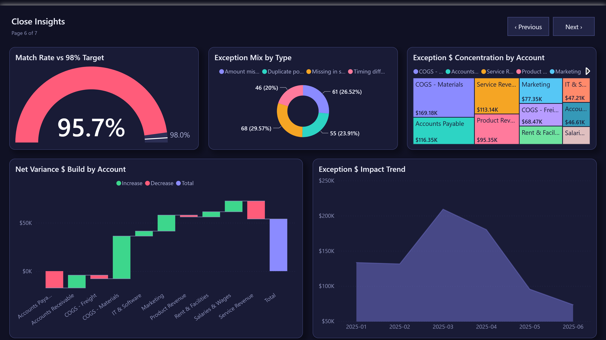
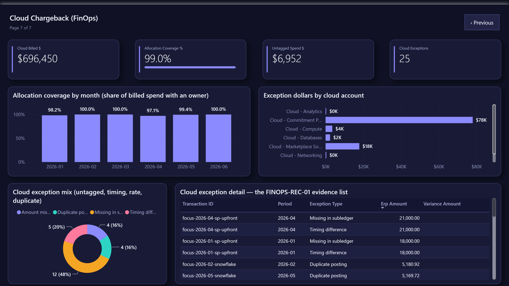
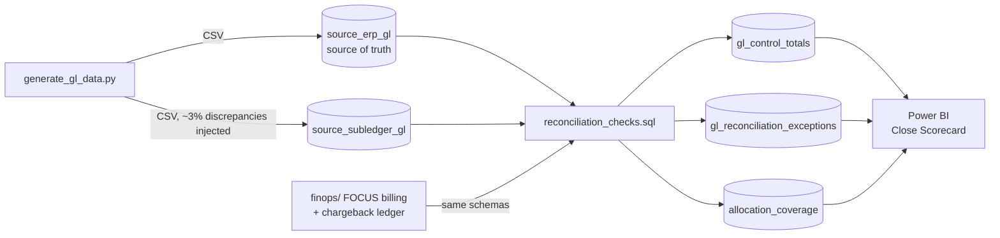
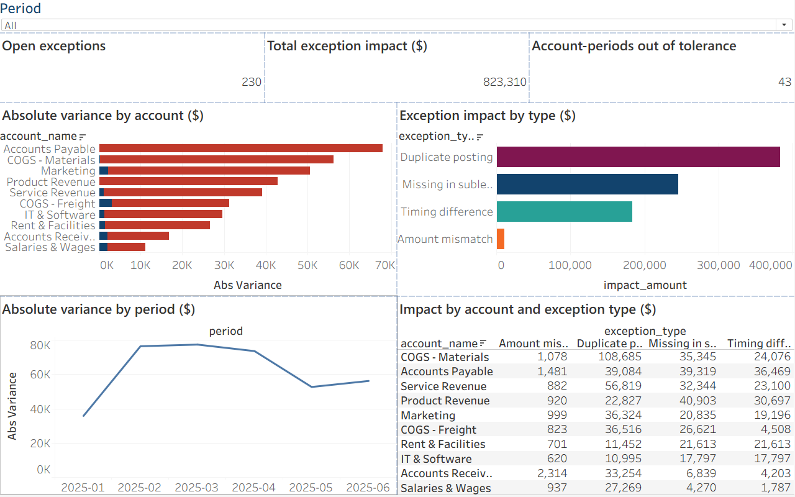

# GL/P&L Reconciliation Dashboard

[](https://github.com/KushPatel29/gl-reconciliation-dashboard/actions/workflows/ci.yml)


Every BI resume says "reconciled GL to subledger." Almost nobody can show
you, because the real work happened inside a company's ERP and left with
the badge. Mine did too — the reconciliation work I did at a food
distributor is described on my resume and locked in their systems.

So this repo is the version you can open. Two ledgers that are supposed to
agree and don't; SQL that finds every disagreement and names it; a
month-end scorecard a controller would actually stare at; and a test suite
that re-proves the whole thing on every push. The data is synthetic (no
real financials anywhere), but the logic is the job.

And because a reconciliation engine shouldn't care what the two systems
are, the second act points the exact same code at a **cloud bill** — more
on that below.

## What actually breaks a month-end close

When the GL says one thing and the AP feed says another, the gap is never
one problem — it's four different problems wearing the same trench coat,
and each needs a different fix and a different owner:

| Type | What happened | How the SQL catches it |
|---|---|---|
| Missing in subledger | The transaction never made it to the feed | LEFT JOIN, ERP row with no subledger match |
| Timing difference | Posted, but in the following period | Same transaction id, different period |
| Amount mismatch | Data-entry or rounding error | Same id + period, amount differs > $0.01 |
| Duplicate posting | Keyed in twice | GROUP BY id + period, count > 1 |

On the generated dataset (~3% of postings deliberately corrupted), the
engine surfaces **230 exceptions**: 68 missing, 61 amount mismatches, 55
duplicates, 46 timing differences. Duplicates are only a quarter of the
count but carry most of the dollars — $145K of the impact — which is
exactly the kind of thing a count-only report hides and a controller needs
to know first.

The detection lives in [`sql/reconciliation_checks.sql`](sql/reconciliation_checks.sql),
written as T-SQL for SQL Server / Fabric Warehouse. The local engine
([`engine/run_reconciliation.py`](engine/run_reconciliation.py)) executes a
direct SQLite translation of it in memory, so the whole thing runs on a
fresh clone in seconds with no database to install — what you read in
`sql/` is what runs.

## The dashboard

Seven Power BI pages, hand-authored as code (TMDL semantic model + PBIR
report definition) in [`powerbi/pbip/`](powerbi/pbip/) — open
`GLReconciliationDashboard.pbip` in Power BI Desktop and hit Refresh.

**Close Scorecard** — the page a controller opens first: match rate,
exception count and dollar impact, accounts out of tolerance:



**Variance by Account** — ERP vs subledger control totals with net variance:



**Exception Detail** — the row-level triage list, split by discrepancy type:



**Exception Ageing** — what happened to the exceptions after they were
found: the ageing ladder, clearing speed by owner against the SLA, and opened
against cleared with the backlog it leaves behind:



**Journal Entry Risk** — the controls test on every entry rather than a sample
of forty, with each test scored against a population it should not fire on:



**Close Insights** — match-rate gauge vs the 98% SLA, variance waterfall by
account, exception mix and impact trend:



## Reconciliation is a control, not a report

In a public company this isn't analytics, it's a key control with an ID on
an audit PBC list. So here's the project written the way internal audit
would write it:

| | |
|---|---|
| **Control ID** | GL-REC-01 — GL-to-subledger reconciliation |
| **Objective** | Completeness & accuracy of the GL: every subledger dollar ties to the GL within materiality |
| **Frequency** | Monthly, at close (CI re-executes it on every code change) |
| **Owner** | Assistant Controller (simulated) |
| **Threshold** | 0.5% of account balance (`Is Out of Tolerance` measure) |
| **Evidence** | `output/gl_control_totals.csv`, categorized exception log, close-scorecard snapshot |
| **Escalation** | Exceptions routed by root cause — duplicates to AP, timing to accruals review |

The pytest suite doubles as control testing. An auditor doesn't take your
word that a control works — they re-perform it. That's literally what the
tests do: corrupt the data in a known way, run the control, confirm it
catches exactly what it claims to catch.

## Whether the ledgers agree is one question. Whether the entries were posted under control is another.

Reconciliation asks the first. Journal-entry testing asks the second, and it is
what an internal audit function, an external auditor's JE procedure, and a
continuous-controls-monitoring programme all open with. Historically it was
answered on a sample of forty entries pulled by hand.
[`engine/journal_risk.py`](engine/journal_risk.py) tests all
5,400, which is the entire argument for doing it in the warehouse.

The ledger extract had no author. It records what was posted and where — enough
to reconcile, nothing like enough to control — so
[`data_generator/generate_journal_detail.py`](data_generator/generate_journal_detail.py)
adds the three files that were missing: `dim_user.csv` (who works in finance
and what they may approve), `journal_control.csv` (author, approver, timestamp,
source system, reversal — one row per existing transaction) and
`exception_workflow.csv` (owner, opened, cleared, method). All additive:
`source_erp_gl.csv` and the subledger are untouched and every existing figure
in this repo keeps its value.

### Most control tests are noise, and the report says which

1,412 of the 5,400 entries are manual
(26.2%), worth $5,020,901, and every other
test is conditioned on that — an interfaced entry inherits the controls of the
system that raised it, and scoring a scheduled job for posting at 03:00 is how
a monitoring programme fills with noise and stops being read.

Then each test is measured against a population it should **not** fire on. A
test that hits as often on interfaced entries as on manual ones is describing
the ledger rather than the behaviour, and
**3 of 8
fail that check**: weekend, close_window, reversal. Weekend posting runs
28.7% on manual entries against
28.4% on interfaced ones, so it is reported as a
non-finding and carries a weight of zero — rather than as
405 exceptions nobody would
have read.

After-hours needs a different baseline again: a scheduled job posts at night by
design, so the automated population is 100% out of hours and comparing a human
to it proves nothing. Manual entries in the close window are compared to manual
entries away from it — same people, same authority, different time pressure —
and the excess is real at 23.6% against
7.4%.

### What is actually wrong

| test | entries | value |
|---|---|---|
| posted and approved by the same person | 120 | $416,746 |
| approved above the approver's own limit | 88 | $1,274,849 |
| amount sitting just under an approval limit | 106 | $652,461 |
| round thousands | 20 | |
| outside business hours | 135 | |

Threshold avoidance is the most-cited red flag in journal testing and is
invisible unless something looks for it deliberately: an entry at $9,850
against a $10,000 limit passes every other control in the list.

The self-approval finding is worth more than its count.
**88% of it is two people**, and
T. Nakamura alone accounts for
55. That is a bottleneck being worked around,
not a policy nobody understands — and it is a different fix.

The composite score uses published weights (self-approval 30, over-limit 25,
threshold avoidance 20, round dollar 10, after-hours 8) and
134 entries clear the review threshold —
9.5% of manual entries,
$578,644. Sized deliberately: a list of a few hundred is
a morning's work, and a control report nobody can finish is a control report
nobody starts.

Benford's law is run per cost centre with a chi-square statistic on 8 degrees
of freedom against the published critical value of
15.507, and
0 of 6 cost centres exceed it.
Benford is a screen, not evidence: a population that conforms is not clean and
one that deviates is not fraudulent. A test feeds the function a deliberately
rigged, 80%-leading-9 population and requires it to fail, because a Benford
implementation that passes everything is not testing anything.

## What happened to the exceptions afterwards

`run_reconciliation.py` identifies 230 differences and stops
there, which is where most reconciliation tooling stops. It is also where the
only question a controller actually has begins: is the close getting better or
worse, and whose queue is holding it up.

[`engine/exception_ageing.py`](engine/exception_ageing.py) answers it.
219 cleared and 11 are still open carrying
$20,372; the median clears in
7 days against a mean of
11.7, a P90 of 29 and a
worst of 61, and 95
(41.3%) breached the 10-day SLA.

**Median and mean are both reported because they disagree, and the
disagreement is the finding.** X. Ferreira takes
8.2× as long as S. Kowalski on the same
work — a uniformly slow queue. S. Kowalski has the opposite
problem: a median of 2 days against a mean of
4.1, which is a handful of exceptions nobody has
touched rather than a slow queue, and it needs a different fix. Averaging the
two together produces one number that describes neither.

72 of 219 (33%) were closed by
accepting them as timing or writing them off below threshold — resolutions that
clear the ticket and change nothing upstream, carrying
$232,823. Those exceptions come back next month. The
backlog grew in 4 of six months and finished at
11.

One join bug is worth recording, because it is the kind that never errors:
`transaction_id` does **not** identify an exception — 184 postings produce
230 of them, because one entry can be both missing from the
subledger and a timing difference. Joining on it alone fanned the workflow out
to 310 rows and inflated every count, median and dollar on the page by a third,
silently. The join now carries `validate="one_to_one"`, and
[`tests/test_exception_ageing.py`](tests/test_exception_ageing.py) adds every
cut back up and demands it land on 230.

## Act two: I pointed the same engine at a cloud bill

Somewhere while building this I realized the hardest problem in mature
FinOps — tying the cloud provider's invoice to the internal cost-center
chargebacks — isn't *like* GL reconciliation. It *is* GL reconciliation.
The same four failure modes show up wearing cloud costumes:

| Engine classification | Cloud billing cause |
|---|---|
| Missing in subledger | **Untagged spend** — no department tag, so the charge never reaches chargeback |
| Timing difference | **Upfront Savings Plan** — billed as a May cash spike, accrued by finance in June |
| Amount mismatch | **Unapplied EDP discount** — billed at list price, allocated at the contracted rate |
| Duplicate posting | **Marketplace double-billing** — SaaS charged via marketplace *and* a direct invoice |

Claiming the analogy is easy; [`finops/`](finops/) proves it by execution.
A billing export shaped like the FinOps Foundation's **FOCUS** spec and its
chargeback ledger get mapped onto the same two staging schemas
(column-by-column guide in [`finops/README.md`](finops/README.md)), and the
engine runs **unmodified** — one test greps the engine source to make sure
no cloud-specific branch ever sneaks in.

It runs at two scales. [`focus_demo.py`](finops/focus_demo.py) plants
exactly one of each anomaly and shows the engine classifying all four.
Then [`generate_focus_data.py`](finops/generate_focus_data.py) does it at
dataset scale: six months, ~410 charge lines, ~$700K billed, anomalies
injected at realistic rates — and every injection is recorded in an
**anomaly manifest**, so the tests can demand the engine recover *exactly*
that set. Nothing missed, nothing invented. A synthetic benchmark without
a manifest is decoration; the manifest is what makes it falsifiable.

The scaled run also computes the one KPI reconciliation alone can't give
you: **allocation coverage**, the share of each month's billed spend that
reached a cost-center owner. Here it's 99.0%, and the gap is precisely the
untagged resources. All of it lands on its own dashboard page:



And because the GL side gets a control ID, the cloud side gets one too:

| | |
|---|---|
| **Control ID** | FINOPS-REC-01 — cloud invoice to cost-center ledger reconciliation |
| **Objective** | Completeness & accuracy of chargebacks: every billed dollar is allocated to an owner |
| **Threshold** | 0.5% of monthly cloud spend for variance investigation |
| **Escalation** | Untagged spend → platform engineering (fix the tags); rate mismatches → vendor management; duplicates → AP |

## The same pattern, anywhere two systems must agree

GL-to-subledger and invoice-to-chargeback are two instances of one
universal problem. The four checks apply unchanged to:

| Industry | System A | System B |
|---|---|---|
| Banking / fintech | Core banking ledger | Payment processor settlement file |
| Insurance | Policy admin system | Claims/billing system |
| Healthcare | EHR charges | Billing clearinghouse |
| E-commerce | Order management | Payment gateway + refunds |
| SaaS | CRM (bookings) | Billing system (invoices) |
| Any M&A / migration | Legacy system | New system during parallel run |

## Architecture



## Repo layout

```
data_generator/     synthetic ERP + subledger GL generator (Python)
data/               generated CSVs (dim_account, dim_cost_center, two GL sources)
                     + dim_user, journal_control (author/approver/timestamp/source)
                     and exception_workflow (owner, opened, cleared, method)
sql/                reconciliation_checks.sql — T-SQL reference for SQL Server/Fabric
finops/             FinOps mode — FOCUS billing generator, mapping, coverage KPI
engine/             SQLite-backed runner: the same SQL, executable with no DB setup
                     journal_risk.py — nine control tests on every entry, each
                     scored against a population it should not fire on, plus
                     Benford by cost centre
                     exception_ageing.py — ageing ladder, clearing SLA by owner,
                     throughput and the resolutions that fix nothing
powerbi/            DAX measure library, build guide, and the ready-to-open
                     PBIP project (TMDL model + PBIR report, 7 pages)
tests/              pytest suite proving each discrepancy class is detected (GL +
                     FinOps), the control tests, the exception workflow, the
                     README's own prose, and the TMDL shape Desktop must parse
output/             engine results — control totals, exception log, summary
.github/workflows/  CI — regenerates data, runs the engine, runs the tests
```

## Run it (60 seconds, no database needed)

```bash
pip install -r data_generator/requirements.txt
python data_generator/generate_gl_data.py     # create the two GL sources
python engine/run_reconciliation.py           # run the reconciliation
python data_generator/generate_journal_detail.py  # authors, approvers, timestamps,
                                              #   and the exception workflow
python engine/journal_risk.py                 # journal-entry control tests + Benford
python engine/exception_ageing.py             # ageing, clearing SLA by owner
python finops/generate_focus_data.py          # FinOps mode: the cloud bill
python finops/run_finops_recon.py             # ...reconciled + coverage KPI
```

Then open the pre-built dashboard —
[`powerbi/pbip/GLReconciliationDashboard.pbip`](powerbi/pbip/) (see
[`powerbi/pbip/OPEN_ME_FIRST.md`](powerbi/pbip/OPEN_ME_FIRST.md)) — or run
the T-SQL directly against SQL Server / Fabric Warehouse.

Verify the claims:

```bash
pip install pytest
pytest tests/ -v    # 368 tests — every discrepancy class found, every dollar accounted for,
                    # in GL mode and FinOps mode, plus Power BI and Tableau workbook
                    # integrity and the semantic-model bindings (every column the
                    # model binds exists in the CSV it reads; a renamed one renders
                    # blank rather than failing)
```

## Tableau version

The same close scorecard, rebuilt in Tableau — one dashboard, seven sheets,
both extracts driven by a single period parameter.



The workbook is **generated, not clicked together**:
[`tableau/build_workbook.py`](tableau/build_workbook.py) emits
[`GLCloseScorecard.twb`](tableau/GLCloseScorecard.twb) as plain XML with
relative connections, so it opens on any machine that has this repo checked
out and every change to it shows up as a reviewable diff rather than a binary
blob. [`tableau/BUILD_TABLEAU.md`](tableau/BUILD_TABLEAU.md) covers the
publish step and what to change if you want to rebuild it by hand instead.

```bash
python engine/run_reconciliation.py
python tableau/prepare_tableau_data.py
python tableau/build_workbook.py       # -> tableau/GLCloseScorecard.twb
```

The numbers on the dashboard are the engine's numbers: 230 exceptions,
$823,310 of impact, 43 of 60 account-periods outside the 0.5% tolerance.
Setting the period parameter to `2025-03` moves all three to 47 / $209,341 / 9,
which is what the same filter returns in pandas — the two data sources stay in
step because one parameter drives a boolean filter in each, rather than two
quick filters that can drift apart.

## Notes on the synthetic data

Everything is generated by `data_generator/generate_gl_data.py` (Faker +
numpy, fixed seeds). No real financial data appears anywhere in this repo —
which is the point: the architecture is reproducible from nothing.

One correction to a claim this section used to make. It said every number
regenerates *identically* on every CI run, and that turned out to be true of
the analytics and not of the ledger underneath them. Adding a byte-for-byte
gate found it: the runner installs exactly the versions the committed data was
written with — pandas 3.0.3, numpy 1.26.3, Faker 40.28.1, Python 3.12 — and
still writes a different `source_erp_gl.csv` on Linux than the workstation
wrote on Windows. Pinning did not fix it.

So CI runs the generator end to end, which proves it works, and then restores
the committed ledger before reconciling. The gate that follows asserts the
claim that is actually true and is the one every figure in this document
depends on: **given this ledger, every published figure regenerates byte for
byte** — the reconciliation, the control tests, the exception workflow and all
thirteen output files. Making the ledger itself machine-independent would
rewrite every number here, the screenshots and the Tableau workbook with them,
which is a change of its own rather than a footnote to this one.
